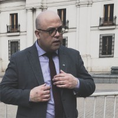

# Felipe Alfonso González

{ width=85 }

> *"We must elevate ourselves above the dust of the world, and seek that Light which alone can guide us to the Temple of Truth."*  
> — Albert Pike

## Personal Information

| Field                 | Details |
|----------------------|---------|
| **Full Name**         | Felipe Alfonso González |
| **Nationality**       | Chilean |
| **Languages**         | Spanish, English, French, Afrikaans |
| **Birth Year**        | 1979 |
| **Current Location**  | Santiago, Chile |
| **Previous Residences** | India, South Africa, New Zealand, California (USA), Zürich (Switzerland) |
| **Occupation**        | Computer Science Engineer |
| **Specialty**         | Systems Architecture, Cybersecurity, Cyber Intelligence |
| **Email**             | [felipe.gonzalez@gnlz.cl](mailto:felipe.gonzalez@gnlz.cl) |
| **Website**           | [www.gnlz.cl](https://www.gnlz.cl) |
| **LinkedIn**          | [felipealfonsog](https://www.linkedin.com/in/felipealfonsog/) |
| **GitHub**            | [felipealfonsog](https://github.com/felipealfonsog) |
| **Twitter/X**         | [@felipealfonsog](https://twitter.com/felipealfonsog/) |

## Professional Summary

Felipe is a **Computer Science Engineer** with over 20 years of experience, specialized in **systems architecture**, **cybersecurity**, and **cyber intelligence**, with strong expertise in **data engineering**, **machine learning**, and **computer science theory**.
